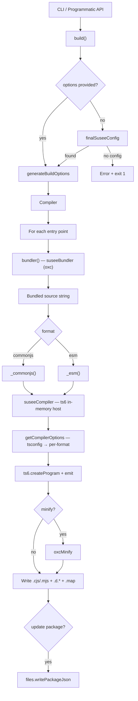

<!-- markdownlint-disable MD033 -->
<!-- markdownlint-disable MD041 -->
<div align="center">

  <h1>Susee</h1>
  <p>A high-performance TypeScript library bundler</p>
</div>
<!-- markdownlint-enable MD033 -->

[![NPM][nodei_img]][nodei_url]

[![npm version][npm_v_img]][npm_v_url] [![license][license_img]](LICENSE) [](https://www.bestpractices.dev/projects/13115) [](https://www.bestpractices.dev/projects/13115)

## Overview

`susee` is a **TypeScript-first bundler** powered by `oxc`, specialized for library packages. Unlike general-purpose bundlers, `susee` focuses on consolidating a package's local TypeScript dependency tree into consolidated source units and compiling them into dual-format artifacts (ESM and CommonJS).

## Key Features

- **TypeScript-first build flow** — built around library development, not application bundling. Preserves a package-oriented workflow with declaration output and clean library artifacts.
- **Dual output support** — produces both ESM and CommonJS from the same entry definition, so packages work with modern `import` and legacy `require` ecosystems.
- **Duplicate declaration validation** — when source consolidation produces conflicting top-level declarations, the build fails with file and location output instead of silently renaming.
- **Fast, low-overhead builds** — a lean pipeline that fits package development and release workflows without app-level complexity.
- **Package metadata update** — can update `package.json` `exports`, `main`, `module`, and `types` fields after build output is generated.
- **Built-in minification** — runs the `oxc-minify` minifier over emitted JavaScript when enabled.
- **CLI and programmatic API** — use the CLI for local development/CI, or call the build API for custom scripting.
- **JSX support** — detects JSX in bundled output and validates the JSX runtime (React or a configured `jsxImportSource`) before compiling.

## Install

```sh
npm i -D susee
```

Verify the installation:

```sh
npx susee --version
```

## Quick Start

### 1. Create a config file

Generate a starter `susee.config.{ts,js,mjs}` in your project root:

```sh
npx susee init
```

The interactive prompt asks whether your project is TypeScript. For TS projects it writes `susee.config.ts`; for JS projects it writes `susee.config.js` (ESM) or `susee.config.mjs` (CommonJS) based on your `package.json#type`.

### 2. Define your entries

```ts
// susee.config.ts
import type { SuSeeConfig } from "susee";

const config: SuSeeConfig = {
  entryPoints: [
    {
      entry: "src/index.ts",   // required — entry file path
      exportPath: ".",         // required — "." for main export, or "./foo"
      format: ["esm"],         // optional, default ["esm"]
      tsconfigFilePath: undefined, // optional, custom tsconfig
      checks: {                // optional, all default false
        checkAnonymous: false,
        checkDefaultExports: false,
        checkNpmInstalled: false,
      },
      minify: false,           // optional: true | { options: MinifyOptions }
    },
  ],
  outDir: "dist",              // optional, default "dist"
  allowUpdatePackageJson: false, // optional, default false
};

export default config;
```

### 3. Build

```sh
npx susee build
```

Susee reads your config, bundles each entry point, compiles to ESM and/or CommonJS, and writes output to `dist` by default.

## CLI

```
susee build                           Build using susee.config.{ts,js,mjs}
susee init                            Generate susee.config.{ts,js,mjs}
susee --version / -v                  Print version
susee --help / -h                     Show help
susee build <entry> [options]         Build from a single entry file
```

### Build Flags

| Flag | Type | Default | Description |
|------|------|---------|-------------|
| `--entry <path>` | string | — | Entry file (optional if given positionally) |
| `--outdir <path>` | string | `dist` | Output directory |
| `--format` | `cjs\|commonjs\|esm` | `esm` | Output module format |
| `--tsconfig <path>` | string | `undefined` | Custom tsconfig path |
| `--allow-update[=true\|false]` | boolean | `false` | Allow `package.json` updates |
| `--minify[=true\|false]` | boolean | `false` | Minify output JS |
| `--check[=true\|false]` | boolean | `false` | Run bundler lint checks |

Flags accept both `--flag=value` and `--flag value` syntax.

### Examples

```sh
npx susee build src/index.ts --outdir dist
npx susee build src/index.ts --format commonjs
npx susee build --entry src/index.ts --format esm --tsconfig tsconfig.build.json
npx susee build src/index.ts --minify
```

## Programmatic API

```ts
import { build, type SuSeeConfig } from "susee";

const config: SuSeeConfig = {
  entryPoints: [
    { entry: "src/index.ts", exportPath: "." },
  ],
  outDir: "dist",
  allowUpdatePackageJson: true,
};

await build(config);
```

`build()` resolves options from the argument first, then from a root config file. If neither is available it logs an error and exits with code 1.

## How It Works



The pipeline bundles each entry point's local dependency tree into a single source string, compiles it in-memory with the TypeScript compiler (`@suseejs/ts6`), optionally minifies with `oxc-minify`, and writes dual-format artifacts with declaration and source-map files.

## Source Architecture

```
src/
├── index.ts            # Public API — re-exports build + SuSeeConfig
├── build.ts            # Build orchestrator — resolves config, runs Compiler
├── bundler.ts          # Wrapper around @suseejs/susee_bundler (oxc)
├── cli/
│   ├── index.ts        # CLI entrypoint & command dispatch
│   ├── parse_args.ts   # Parses CLI flags into SuSeeConfig
│   ├── init.ts         # `susee init` — scaffolds config file
│   └── print_help.ts   # `susee --help` output
├── compiler/
│   ├── index.ts        # Compiler class — bundles + emits CJS/ESM + types
│   ├── suseeCompiler.ts# In-memory TypeScript compilation host
│   └── tsoptions.ts    # Resolves tsconfig.json into per-format options
├── config/
│   └── index.ts        # Config types, validation, and normalization
└── helpers/
    ├── files.ts        # File system namespace + package.json writer
    └── minify.ts       # oxc-minify wrapper
```

See [`src/README.md`](src/README.md) for detailed module documentation.

## Configuration Reference

### `SuSeeConfig`

| Field | Type | Required | Default | Description |
|-------|------|----------|---------|-------------|
| `entryPoints` | `EntryPoint[]` | yes | — | Array of entry point definitions |
| `outDir` | `string` | no | `dist` | Output directory |
| `allowUpdatePackageJson` | `boolean` | no | `false` | Allow susee to update `package.json` |

### `EntryPoint`

| Field | Type | Required | Default | Description |
|-------|------|----------|---------|-------------|
| `entry` | `string` | yes | — | Entry file path |
| `exportPath` | `"." \| "./${string}"` | yes | — | Export path for this entry |
| `format` | `("commonjs" \| "esm")[]` | no | `["esm"]` | Output module formats |
| `tsconfigFilePath` | `string` | no | `undefined` | Custom tsconfig path |
| `checks` | `CheckOptions` | no | all `false` | Bundler lint checks |
| `minify` | `boolean \| { options: MinifyOptions }` | no | `false` | Minify output |

### `CheckOptions`

| Field | Type | Default | Description |
|-------|------|---------|-------------|
| `checkAnonymous` | `boolean` | `false` | Check for anonymous declarations |
| `checkDefaultExports` | `boolean` | `false` | Check default exports |
| `checkNpmInstalled` | `boolean` | `false` | Check that npm deps are installed |

### TSConfig Resolution Priority

For each entry point, compiler options resolve in this order:

1. Custom `tsconfigFilePath` on the entry point
2. `tsconfig.json` at the project root
3. Susee defaults (`module: ES2020` for ESM, `module: CommonJS` for CJS, `target: Latest`)

## Development

```sh
npm run build    # compile src/ via oxnode build.ts
npm run lint     # oxlint
npm run fmt      # oxfmt
```

## Key Dependencies

- [`@suseejs/susee_bundler`](https://www.npmjs.com/package/@suseejs/susee_bundler) — oxc-powered bundling engine
- [`@suseejs/ts6`](https://www.npmjs.com/package/@suseejs/ts6) — TypeScript compiler fork for type-checking and declaration emit
- [`@suseejs/color`](https://www.npmjs.com/package/@suseejs/color) — terminal color output
- [`@suseejs/type`](https://www.npmjs.com/package/@suseejs/type) — shared type utilities
- [`oxc-minify`](https://www.npmjs.com/package/oxc-minify) — JavaScript minification

## License

[Apache-2.0][license] © [Pho Thin Maung][ptm]

<!-- markdownlint-disable MD053 -->

[license]: LICENSE
[file-contribute]: CONTRIBUTING.md
[ptm]: https://github.com/phothinmg

<!-- Need to update version -->

[sb_img]: https://badge.socket.dev/npm/package/susee/1.5.2
[sb_url]: https://badge.socket.dev/npm/package/susee/1.5.2

<!--  -->

[nodei_img]: https://nodei.co/npm/susee.svg?color=red
[nodei_url]: https://nodei.co/npm/susee/
[npm_v_img]: https://img.shields.io/npm/v/susee
[npm_v_url]: https://www.npmjs.com/package/susee
[license_img]: https://img.shields.io/npm/l/susee
[publish_npm]: https://github.com/phothinmg/susee/actions/workflows/ci.yml
[publish_npm_svg]: https://github.com/phothinmg/susee/actions/workflows/npm-publish.yml/badge.svg?event=release
[mmcov_svg]: https://img.shields.io/badge/mmcov-85.01%25-green?style=flat&labelColor=%232c3e50
[mmcov_url]: https://suseejs.org/coverage
