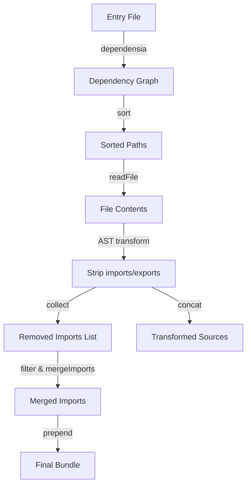

# Bundler Module (src/bundle.ts)

This module exports a single function, `bundle`, which takes a TypeScript entry file and produces a self-contained JavaScript bundle. It resolves all dependencies, strips import/export statements, merges duplicate imports, and concatenates the transformed code into one string.  

## 🔍 Features

- 🔗 **Dependency Graph**: Builds a complete graph of file dependencies using `dependensia`.  
- ✂️ **AST Transformation**: Removes import and export statements via the TypeScript compiler API.  
- 🔄 **Import Merging**: Deduplicates and merges remaining import statements across files.  
- 📝 **Concatenation**: Joins processed contents into a single code output.  
- 📦 **Export Flag**: Returns a `dexport` boolean indicating mixed named/default exports.

## 📦 Dependencies

The module relies on several external and internal utilities:

| Import                  | Source                         | Purpose                                        |
|-------------------------|--------------------------------|------------------------------------------------|
| `dependensia`           | npm package                    | Generates dependency graph from entry file.    |
| `typescript` (`ts`)     | npm package                    | Parses and prints AST; performs transformations. |
| `readFile`, `resolvePath`, `wait` | `./helpers`            | File I/O, path resolution, and async delay.    |
| `mergeImports`          | `./mergeImports`               | Merges and deduplicates import statements.     |

---

## 📘 Function: `bundle`

```ts
async function bundle(
  entry: string,
  isESM = false,
): Promise<{ code: string; dexport: boolean; }>
```

**`bundle`** takes an entry file path and an optional ESM flag, then returns:
- `code` — the final bundled JavaScript as a single string.  
- `dexport` — `true` if both named and default exports were detected (and not targeting ESM).

### Parameters

- `entry: string`  
  Path to the TypeScript entry file.  
- `isESM: boolean` (default: `false`)  
  Indicates whether output should preserve ES module semantics.

### Returns

A Promise resolving to:

| Property | Type    | Description                                                                  |
|----------|---------|------------------------------------------------------------------------------|
| code     | string  | Bundled code with merged imports and stripped exports.                       |
| dexport  | boolean | `true` if mixed named/default exports exist (and `isESM` is `false`).       |

---

## ⚙️ How It Works

Below is the high-level flow of the bundling process:



1. **Build Graph**  
   Uses `dependensia(entry)` to list all dependent files in topological order.  
2. **Read Files**  
   Reads each file’s content via `readFile(resolvePath(path), "utf8")`.  
3. **Strip Imports & Exports**  
   - Creates a TypeScript `SourceFile` AST.  
   - Visits each node to remove or flag `import` and `export` statements.  
   - Collects raw import texts in `removedStatements`.  
4. **Filter & Merge Imports**  
   - Filters out local (`./` or `../`) imports.  
   - Deduplicates via `mergeImports`.  
5. **Concatenate & Return**  
   - Joins merged imports and transformed file contents.  
   - Returns the final code string and `dexport` flag.

---

## 🔧 Implementation Details

- **AST Transformation**  
  Utilizes a custom `ts.TransformerFactory` that:  
  - Strips out `ImportDeclaration` and `ImportEqualsDeclaration`.  
  - Removes `ExportDeclaration` and `ExportAssignment` based on flags.  
  - Tracks if named (`export {...}`) and default (`export = identifier`) exports appear.  
- **Export Flags**  
  - `isNameExport`: set when a named export is found.  
  - `isDefaultExport`: set when a default-export assignment with an identifier is found.  
  - `dexport` is `true` only if both flags are `true` and `isESM` is `false`.  
- **Import Merging**  
  Calls `mergeImports(removedStatements)` to:  
  - Combine identical module imports.  
  - Remove type-only imports if corresponding value imports exist.

---

```card
{
  "title": "Export Handling Caveat",
  "content": "Only named exports and default exports with identifiers are removed. Other forms may remain in the bundle."
}
```

---

## 🗂️ Helper Files

- **`./helpers`**  
  Provides:
  - `readFile(path, encoding)`: Reads file contents.  
  - `resolvePath(path)`: Resolves relative file paths.  
  - `wait(ms)`: Async delay used to throttle processing.  
- **`./mergeImports`**  
  Accepts an array of raw import strings and returns a minimized set.

These utilities enable file I/O abstraction and import-statement optimization.

---

By combining AST manipulation with dependency resolution, `bundle.ts` delivers a streamlined, single-file JavaScript output suitable for environments without native module support or for quick prototype deployments.