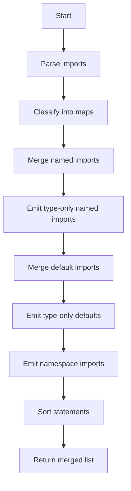

# mergeImports Utility

The **`mergeImports`** function consolidates multiple ES module import statements into a minimal set of imports per module. It removes duplicates, merges specifiers by category, and sorts entries alphabetically for consistent output.

## Function Signature and Purpose
The function signature is:
```ts
function mergeImports(imports: string[]): string[];
```
It accepts an array of raw import strings and returns a new array where:
- **Named imports** from the same module are combined into one statement.  
- **Default imports** are merged similarly.  
- **Type-only imports** (`import type …`) get their own grouped statements.  
- **Namespace imports** (`import * as …`) are consolidated.  
- Duplicate specifiers are removed and **everything is sorted** for readability. 

## Key Features
- **Single point of truth**: All specifiers from one module become one import.  
- **Type separation**: Runtime vs. type-only imports never mix.  
- **Alphabetical order**: Both specifier lists and final statements are sorted.  
- **Namespace merging**: Multiple `* as X` imports for a module collapse into one.  

## Internal Data Structures
Five `Map<string, Set<string>>` objects classify imports by module path and category:

| Map Name               | Role                                    |
|------------------------|-----------------------------------------|
| `importMap`            | Named runtime imports (`{ A, B }`)      |
| `typeImportMap`        | Named type-only imports                 |
| `defaultImports`       | Default runtime imports (`import X`)    |
| `typeDefaultImports`   | Default type-only imports               |
| `namespaceImports`     | Namespace imports (`* as X`)            | 

## How It Works
1. **Parse** each string with a regex that extracts:
   - Whether it’s a type import (`import type`)  
   - The _clause_ (e.g. `{ A, B }`, `X`, `* as Y`)  
   - The _module path_ (`'module'`)  
2. **Classify** by clause:
   - Empty clause → default import or side-effect; recorded in `defaultImports` or `typeDefaultImports`.  
   - `{ … }` → named; recorded in `importMap` or `typeImportMap`.  
   - `* as …` → namespace; recorded in `namespaceImports`.  
3. **Merge** per module:
   - Named imports: unite runtime and type-only (excluding duplicates).  
   - Emit a `import { … } from "module";`.  
4. **Emit** remaining type-only named imports:
   ```ts
   import type { T1, T2 } from "module";
   ```
5. **Merge and emit** default imports similarly.  
6. **Emit** type-only defaults if no runtime default exists.  
7. **Emit** namespace imports:
   ```ts
   import * as ns from "module";
   ```
8. **Sort** the final array of statements before returning. 

## Parsing Logic
- Regex:  
  ```js
  /import\s+(?:type\s+)?(?:(.*?)\s+from\s+)?["']([^"']+)["'];?/
  ```  
  - Captures optional `type`, the import clause, and the module path.  
- Classification examples:
  - `import { A, B } from 'x';` → Named  
  - `import type { T } from 'x';` → Type-only named  
  - `import Y from 'x';` → Default  
  - `import type Z from 'x';` → Type-only default  
  - `import * as ns from 'x';` → Namespace  

## Usage in the Bundler Pipeline
Within **`bundle.ts`**, extracted import statements are merged before code assembly:
```ts
// After collecting imports across files...
removedStatements = mergeImports(removedStatements);
return {
  code: `${removedStatements.join("\n")}\n${bundledCode}`.trim(),
  dexport: isNameExport && isDefaultExport,
};
```  
This ensures the final bundle contains one clean import per module .

## Example
```ts
const imports = [
  "import { foo, bar } from 'module';",
  "import { baz } from 'module';",
  "import type Qux from 'module';",
  "import foo from 'module';"
];

console.log(mergeImports(imports));
// [
//   'import { bar, baz, foo } from "module";',
//   'import foo from "module";',
//   'import type Qux from "module";'
// ]
```

## Merge Flowchart


## Card: Important Note
```card
{
  "title": "Alphabetical Sorting",
  "content": "Specifiers and statements are always sorted to keep imports predictable."
}
```