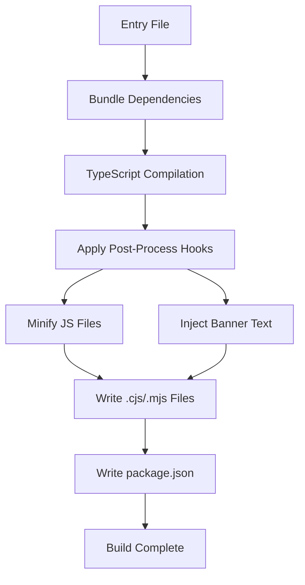

# susee Bundler – Minify Hook 📦

A **Post-Process Hook** that integrates [Terser](https://github.com/terser/terser) to minify bundled JavaScript output. Use this hook to reduce file size by removing whitespace, shortening identifiers, and applying advanced compression techniques.

---

## What It Does

- **Detects** `.js` files by their extension.
- **Invokes** Terser’s `minify` on the code.
- **Returns** minified code for further processing or writing to disk.

---

## Source Code

```ts
import path from "node:path";
import { type MinifyOptions, minify as minify2 } from "terser";
import type { OutPutHook } from "../types";

/**
 * Minifies given code using Terser.
 *
 * @param options Optional options for Terser.
 * @returns A hook conforming to OutPutHook.
 */
const minify = (options?: MinifyOptions): OutPutHook => {
  return {
    async: true,
    func: async (code, file) => {
      if (path.extname(file as string) === ".js") {
        code = (await minify2(code, options)).code as string;
      }
      return code;
    },
  };
};

export default minify;
```  
<!-- src/minify/index.ts  -->

---

## Hook Signature

| Property    | Type                                         | Description                                           |
| ----------- | -------------------------------------------- | ----------------------------------------------------- |
| **async**   | `true`                                       | Marks this hook as asynchronous.                      |
| **func**    | `(code: string, file?: string) => Promise<string>` | Receives code and file path, returns (minified) code. |

> The hook implements the `OutPutHook` interface defined in `src/types.ts` .

---

## Parameters

| Name      | Type             | Default | Description                                       |
| --------- | ---------------- | ------- | ------------------------------------------------- |
| `options` | `MinifyOptions`  | `{}`    | Configuration options passed directly to Terser.  |

You can fine-tune compression, mangling, and other behaviors via Terser’s [`MinifyOptions`](https://github.com/terser/terser#minify-options).

---

## How to Use

1. **Import** the hook in your build script.
2. **Pass** `minify()` (or with custom options) to the `hooks` array in `susee.build`.

```ts
import susee from "susee";
import minify from "susee/minify";

await susee.build({
  entry: "src/index.ts",
  outDir: "dist",
  defaultExportName: "myLib",
  hooks: [
    // other hooks…
    minify({ mangle: { toplevel: true } })
  ],
});
```  
<!-- Example from build.ts  -->

---

## Integration in Build Pipeline



---

## Key Points 📝

- **Selective Minification**: Only files with a `.js` extension are processed.
- **Async Execution**: Ensures that large files don’t block the build.
- **Customizable**: Pass any valid Terser options to tailor compression.
- **Composable**: Works alongside other hooks like `bannerText` for flexible post-processing.

---

## Related Files & Context

| File                                | Responsibility                                                |
| ----------------------------------- | ------------------------------------------------------------- |
| **src/types.ts**                    | Defines `OutPutHook`, `PostProcessHook`, and build types.     |
| **src/banner-text/index.ts**        | A sync hook to prepend license or banner comments.            |
| **src/compilers.ts**                | Applies hooks after TS compilation for CJS & ESM outputs.    |
| **src/helpers.ts**                  | File system utilities (`writeOutFile`, `clearFolder`, etc.).  |
| **src/package.ts**                  | Updates `package.json` exports, main/module/type fields.      |
| **build.ts** (project root)         | Example script showcasing usage of `minify` and other hooks.  |

By leveraging this **Minify Hook**, you can seamlessly incorporate production-ready compression into your susee build pipeline, ensuring your library ships in its smallest possible form.