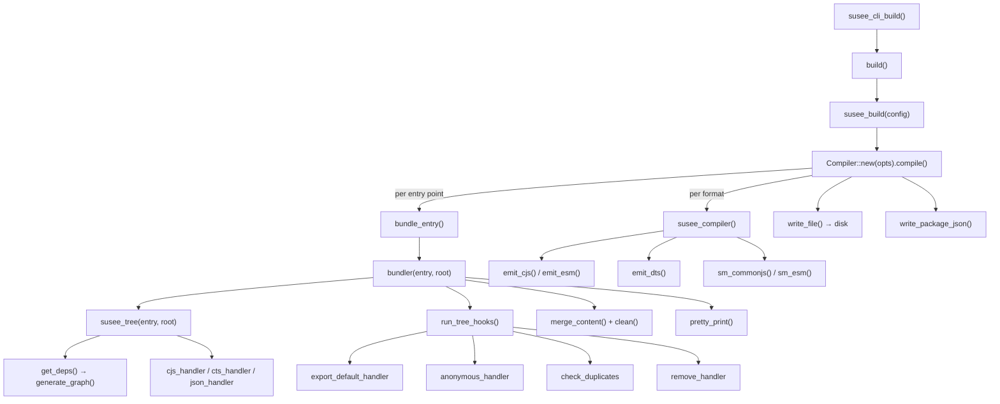

# Susee — Rust Codebase Architecture (`/src`)

> Susee is a TypeScript/JavaScript bundler and compiler written in Rust.
> It analyses a project's dependency graph, bundles all local modules into
> a single file, applies tree-shaking and rename hooks, then emits
> CommonJS and/or ESM output with `.d.ts` declarations and source maps.

---

## 1. Module map

```
src/
├── main.rs                          — binary entry point
├── lib.rs                           — crate root, re-exports public API
└── core/
    ├── mod.rs                       — module hub, re-exports
    ├── susee_build/                 — build orchestration
    ├── susee_bundler/               — bundling pipeline
    ├── susee_cli/                   — CLI argument parsing & dispatch
    ├── susee_compiler/              — code emission (CJS, ESM, .d.ts, sourcemap)
    ├── susee_config/                — config file reading & normalisation
    ├── susee_hooks/                 — tree hooks & unused-code removal
    ├── susee_log/                   — coloured console output
    ├── susee_tree/                  — dependency graph + module handlers
    ├── susee_types/                 — shared types (DepsFile, enums, visitors)
    ├── susee_unique_name/           — collision-free identifier generator
    └── susee_utils/                 — file I/O, AST helpers, import utilities
```

---

## 2. Pipeline overview



---

## 3. Module details

### 3.1 `susee_cli`

CLI entry point.  Mirrors `suseeCliBuild()` from the TS implementation.

| File | Responsibility |
|------|----------------|
| `index.rs` | `susee_cli_build()` — reads `argv`, dispatches `build`/`init`/`--help`/`--version`. `cli_init()` writes `susee.config.json`. |
| `cli_utils.rs` | `parse_args()` — parses `--entry`, `--out-dir`, `--format`, `--tsconfig`, `--warning`, `--profile` flags. `print_help()`, `fail()`. |
| `cli_options.rs` | `cli_compiler_build(opts)` — bridges CLI options to `Compiler`. |

### 3.2 `susee_config`

Reads and normalises the `susee.config.jsonc` file.

| File | Responsibility |
|------|----------------|
| `config_types.rs` | `SuSeeConfig`, `EntryPoint`, `BuildOptions`, `BuildEntryPoint`, `OutputFormat`. `get_susee_config_path()`, `read_config_file()`, `generate_build_options()`, `check_entries()`. |
| `ts_options.rs` | `CompilerOptions`/`CompilerOptionsBuilder`. `get_compiler_options()` reads `tsconfig.json`. `strip_jsonc_comments()` removes `//` and `/* */` comments from JSONC. |

### 3.3 `susee_build`

Top-level build orchestration.

| Function | Description |
|----------|-------------|
| `build(config: Option<&SuSeeConfig>)` | If `config` is `None`, reads from disk. Calls `susee_build()`. |
| `susee_build(config)` | Generates `BuildOptions`, creates a `Compiler`, calls `.compile()`. |

### 3.4 `susee_compiler`

Emits JavaScript, type declarations, and source maps from bundled code.

| File | Responsibility |
|------|----------------|
| `index.rs` | `Compiler` struct — drives the full compile cycle. `compile_format()` bundles → compiles → writes. `write_package_json()` updates `package.json` exports. |
| `susee_compiler.rs` | `susee_compiler(CompilerParams)` — core compile step. Calls `emit_cjs`/`emit_esm` and `emit_dts`. |
| `cjs.rs` | `emit_cjs()` — transforms TS → CJS: strips types, converts `import`/`export` to `require`/`module.exports`, handles top-level await via async IIFE. |
| `esm.rs` | `emit_esm()` — transforms TS → ESM: strips types, preserves `import`/`export`. |
| `dts.rs` | `emit_dts()` — generates `.d.ts` files. Infers return types, reads JSDoc annotations, annotates missing types. |
| `source_map.rs` | `sm_commonjs()` / `sm_esm()` — oxc codegen-based source map generation. |

### 3.5 `susee_bundler`

The bundling pipeline — takes an entry file and root path, produces a
single bundled string.

| Function | Description |
|----------|-------------|
| `bundler(entry, root)` | 1. `susee_tree()` → dependency tree. 2. `run_tree_hooks()` → rename/normalize. 3. `merge_content()` → concatenate. 4. `clean()` → remove unused. 5. `pretty_print()` → oxc codegen round-trip. |
| `pretty_print(content, file)` | Parse + re-emit via oxc `Codegen` with comments preserved. |

**`BundleResult`** — `{ bundled_code: String, project_type: ProjectType }`.

### 3.6 `susee_tree`

Builds the dependency graph and normalises module formats.

| File | Responsibility |
|------|----------------|
| `index.rs` | `susee_tree(entry, root)` — uses `dependansa::generate_graph` to build the graph, sorts topologically, creates `DepsFile` entries. Determines `ProjectType` (TS/JS/MIXED) from file extensions. |
| `cjs_handler.rs` | Converts CommonJS `require`/`module.exports` → ESM `import`/`export`. |
| `cts_handler.rs` | Converts `.cts` `import = require()` / `export =` → ESM. Renames `.cts` → `.ts`. |
| `json_handler.rs` | Wraps `.json` imports as typed TS modules (`const _jname = {...}`). |

### 3.7 `susee_hooks`

Post-tree transformations run after the dependency graph is built.

**Hook order** (in `run_tree_hooks`):

1. **`export_default_handler`** — renames named default exports to
   `_d<name>$<n>` and updates import bindings across files.
2. **`anonymous_handler`** — assigns names to anonymous default exports
   (`export default function() {}` → `function _a<file>$<n>() {}`) and
   updates references.
3. **`check_duplicates`** — detects duplicate top-level declaration names
   across files and renames them to `_u<name>$<n>`.
4. **`remove_handler`** — strips `import`/`export` statements from
   non-entry files (they're inlined into the bundle).

**Pre-process hooks:**

| File | Responsibility |
|------|----------------|
| `unused_code.rs` | `clean()` / `clean_unused_code()` — removes unused imports and declarations via AST span analysis. |

### 3.8 `susee_types`

Shared types used across the codebase.

| Type | Description |
|------|-------------|
| `DepsFile` | A single file in the dependency graph: `file`, `content`, `bytes`, `module_type`, `file_ext`, `is_jsx`, `is_entry`. |
| `DependenciesTree` | Full tree: `entry`, `npm`, `nodes`, `warns`, `dep_files`, `project_type`. |
| `ValidExts` | Enum of valid file extensions (`.js`, `.cjs`, `.mjs`, `.ts`, `.cts`, `.mts`, `.tsx`, `.jsx`, `.json`). |
| `ModuleType` | `Cjs`, `Esm`, `Cts`, `Json`. |
| `ProjectType` | `TS`, `JS`, `MIXED`. |
| `ModuleTypeDetector` | AST visitor that detects CJS vs ESM syntax. |
| `JsxDetector` | AST visitor that detects JSX elements. |
| `SpecifierSpanCollector` | AST visitor that collects import/export specifier spans for renaming. |

### 3.9 `susee_unique_name`

Collision-free identifier generator.

Generates `_<sigil><input>$<count>` names:

| Sigil | Constant | Category | Example |
|-------|----------|----------|---------|
| `a` | `sigil::ANONYMOUS` | Anonymous default export | `_aunusedCode$1` |
| `d` | `sigil::DEFAULT` | Named default export | `_dhello$1` |
| `u` | `sigil::DUPLICATE` | Duplicate declaration | `_ushared$1` |
| `j` | `sigil::JSON` | JSON module | `_jconfig$1` |

`UniqueName::new()` → `set_prefix(key, sigil)` → `get_name(key, input)`.
Input is sanitized via `sanitize_identifier` (non-alphanumeric → `_`).

### 3.10 `susee_utils`

File I/O, AST helpers, and import-string parsing utilities.

| Function | Description |
|----------|-------------|
| `read_file(root, rel)` | Read file → `(String, usize)`. |
| `write_file(path, content)` | Write string to file. |
| `json_ext_to_ts(file)` | Replace `.json` extension with `.ts`. |
| `with_parsed_program(file, content, f)` | Parse content as TS/JS, call `f` with the `Program`. |
| `detect_module_type(content, path)` | CJS / ESM / CTS / Json detection. |
| `is_jsx_content(content, path)` | JSX detection via AST visitor. |
| `collect_top_level_declaration_names(program)` | AST-based top-level name collection (excludes imports). |
| `apply_renames(file, content, rename_map)` | Rename identifiers in source text via semantic + AST span replacement. |
| `merge_content(deps_files)` | Concatenate dep files with `//file` separators. |
| `merge_imports_statement(imports)` | De-duplicate and merge import statements from the same module. |
| `is_non_local_import(s)` | Check if an import is from `npm`/`node:` (not `./` or `../`). |
| `extract_default_name(s, is_type)` | Extract default import binding name. |
| `extract_module_path(s)` | Extract module specifier from import string. |
| `extract_import_clause(s, path, is_type)` | Extract the import clause (between `import` and `from`). |

### 3.11 `susee_log`

Coloured console output using the `colored` crate.

| Function | Description |
|----------|-------------|
| `error(info, cause, e)` | Print error with info/cause; `exit(1)` if `e` is true. |
| `info(message)` | Print info message. |
| `warning(message)` | Print warning. |
| `bundle_time(start)` | Print elapsed time in ms. |

---

## 4. Key data flow

```
Entry file path
    │
    ▼
dependansa::generate_graph  ──▶  topologically sorted file list
    │
    ▼
get_deps  ──▶  Vec<DepsFile>  (read + detect module type)
    │
    ▼
cjs_handler / cts_handler / json_handler  ──▶  all files normalised to ESM/TS
    │
    ▼
DependenciesTree { dep_files, project_type, npm, nodes, warns }
    │
    ▼
run_tree_hooks:
  1. export_default_handler   ──▶  rename named defaults:  _d<name>$<n>
  2. anonymous_handler         ──▶  name anonymous defaults: _a<file>$<n>
  3. check_duplicates          ──▶  rename duplicates:       _u<name>$<n>
  4. remove_handler            ──▶  strip imports/exports from non-entry files
    │
    ▼
merge_content  ──▶  "import statements\n dep_files_content\n entry_content"
    │
    ▼
clean()         ──▶  remove unused imports/declarations
    │
    ▼
pretty_print()  ──▶  oxc codegen round-trip (normalise formatting)
    │
    ▼
BundleResult { bundled_code, project_type }
    │
    ▼
susee_compiler  ──▶  emit_cjs() / emit_esm() / emit_dts() / source_map
    │
    ▼
write_file  ──▶  dist/<format>/<name>.{cjs,mjs,d.cts,d.mts,map}
```

---

## 5. Testing

Tests are embedded as `#[cfg(test)] mod tests` blocks within each source
file.  The `__tests__` directory at the workspace root contains additional
TypeScript-level integration tests.

| Module | Has `#[cfg(test)]`? | Key tests |
|--------|---------------------|-----------|
| `susee_utils` | ✅ | `json_ext_to_ts`, `detect_module_type`, `is_jsx_content`, `read_file` |
| `susee_unique_name` | ✅ | name generation, sanitization, sigil prefixes |
| `susee_config/config_types` | ✅ | config reading, entry validation |
| `susee_config/ts_options` | ✅ | tsconfig parsing, `strip_jsonc_comments` |
| `susee_hooks/mod` | ✅ | hook ordering |
| `susee_hooks/anonymous` | ✅ | anonymous export/import naming |
| `susee_hooks/duplicates` | ✅ | duplicate detection & renaming |
| `susee_hooks/export_default` | ✅ | default export renaming |
| `susee_hooks/remove` | ✅ | import/export removal |
| `susee_hooks/unused_code` | ✅ | unused code elimination |
| `susee_compiler/cjs` | ✅ | CJS emission |
| `susee_compiler/esm` | ✅ | ESM emission |
| `susee_compiler/dts` | ✅ | `.d.ts` generation |
| `susee_tree/cjs_handler` | ✅ | `require` → `import` conversion |
| `susee_tree/cts_handler` | ✅ | CTS → ESM conversion |
| `susee_tree/json_handler` | ✅ | JSON module wrapping |
| `susee_bundler` | ❌ | — |
| `susee_tree/index` | ❌ | — |
| `susee_build` | ❌ | — |
| `susee_cli/index` | ❌ | — |
| `susee_cli/cli_options` | ✅ | CLI option parsing |
| `susee_compiler/index` | ❌ | — |
| `susee_compiler/susee_compiler` | ❌ | — |
| `susee_compiler/source_map` | ❌ | — |
| `susee_types` | ❌ | — |
| `susee_log` | ❌ | — |

---

## 6. Dependencies

| Crate | Usage |
|-------|-------|
| `oxc` | AST parsing, semantic analysis, code generation, source maps |
| `dependensa` | Dependency graph generation & topological sort |
| `serde` / `serde_json` | Config file (de)serialization |
| `colored` | Coloured terminal output |
| `tempfile` (dev) | Temp directories for tests |

---

## 7. Naming convention

Tool-generated identifiers follow the pattern `_<sigil><input>$<count>`:

- Leading `_` marks the name as tool-generated (avoiding collisions with
  user code).
- `<sigil>` is a single lowercase letter identifying the category.
- `<input>` is the sanitized original name or file stem.
- `$<count>` is a per-key counter ensuring uniqueness.

See [`susee_unique_name`](#39-susee_unique_name) for the sigil table.